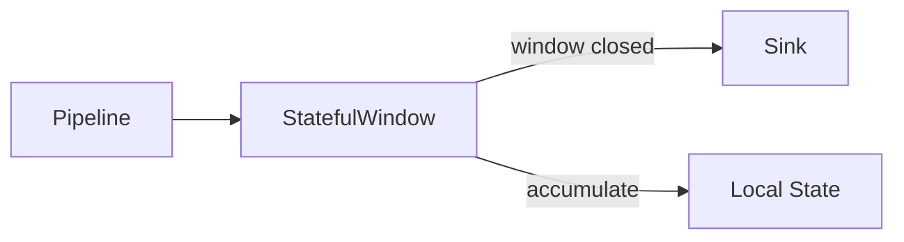

# qbuem-stack Ecosystem Expansion Proposal

This document outlines the proposed high-performance modules for the WAS, Message Middleware, Pipeline, and Action layers, extending the stack's capabilities beyond the v2.4.0 primitives.

## 1. Web Application Server (WAS)

### qbuem::http::TemplateEngine (Zero-Copy Rendering)
- **Concept**: A C++-native template engine that compiles templates (HTML/JSON) into executable C++ code at compile-time or optimized bit-code at runtime.
- **Performance**: Renders directly into `MutableBufferView` without any intermediate strings or heap allocations.
- **Feature**: Supports "Partials" that are pre-rendered into shared memory for instant insertion.

### qbuem::http::AdaptiveRateLimiter
- **Concept**: A middleware that adjusts request limits based on system load (CPU/Memory).
- **Optimization**: Uses a lock-free `SlidingWindow` (mapped to `TimerWheel`) for sub-microsecond rate-check latency.

---

## 2. Message Middleware (IPC)

### qbuem::shm::ReliableCast<T> (Zero-copy Multicast)
- **Concept**: Optimized 1:N communication using a single shared read-only segment.
- **Advantage**: Data is written once by the Producer; $N$ Consumers read directly from the same physical pages without message duplication.
- **Reliability**: Tracking consumer head-pointers; Producer only overwrites when the slowest consumer has read (or drops based on policy).

### qbuem::shm::TopicSchemaRegistry
- **Concept**: Automated schema validation at the IPC level.
- **Integration**: Works with `qbuem-json` or binary schemas (Nexus Fusion) to validate messages as they enter/exit the bus.

---

## 3. Pipeline & Stream Processing

### qbuem::pipeline::StatefulWindow Action
- **Concept**: Native support for windowed operations (Tumbling, Sliding, Session).
- **Performance**: Aggregates data (Sum, Avg, Max/Min) in thread-local storage with periodic flushes to the next stage.
- **UML Logic**:

### qbuem::pipeline::DynamicRouter Predicate (SIMD-accelerated)
- **Concept**: A stage that routes messages based on predicates.
- **Optimization**: Uses SIMD to evaluate multiple predicates (e.g., "price > 100 AND symbol == 'AAPL'") simultaneously across a batch of messages.

---

## 4. Advanced Actions (Middleware Logic)

### qbuem::action::Batcher<T>
- **Concept**: Accumulates small payloads into a single large batch.
- **Use Case**: Preparing data for SIMD-accelerated processing, NPU inference, or batch-insert into a database.
- **Timer**: Flushes automatically using `Reactor` timers even if the batch is not full.

### qbuem::security::SIMDValidator
- **Concept**: High-speed JSON Schema or binary structural validation.
- **Performance**: Validates data at wire speed (10GB/s+) using SIMD skip-patterns (similar to `qbuem-json`'s parser).

---

## Roadmap Integration (Beyond v2.4.0)

We recommend scheduling these as **v2.5.0 (Stream Processing)** and **v2.6.0 (Advanced WAS)** milestones. This keeps the core stack focused while providing deep vertical capabilities.
