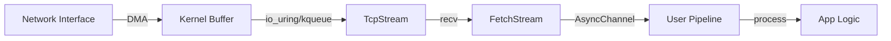

# qbuem-stack Fetch Advancement Proposal (v2.7.0+)

The `Fetch` module provides a non-blocking HTTP client. This proposal outlines the path to making it a world-class, high-performance networking tool.

## 1. Zero-Copy Body Streaming
- **Requirement**: Current fetch buffers the entire response in RAM.
- **Solution**: Introduce `FetchClient::stream(url)`, which returns a `FetchStream`.
- **Logic**: The body is delivered via an `AsyncChannel<std::span<std::byte>>` as it arrives from the kernel. This allows processing 10GB+ files with constant 64KB memory overhead.

## 2. HTTP/2 & HTTP/3 Support
- **HTTP/2**: Implement a frame-based multiplexing layer. A single `TcpStream` will handle multiple concurrent `Task<FetchResponse>` calls, significantly reducing handshake overhead for microservices.
- **HTTP/3 (QUIC)**: Integrate with a UDP-based transport to eliminate head-of-line blocking in high-loss environments.

## 3. Native TLS (HTTPS) Integration
- **Status**: Currently HTTPS is unsupported in `FetchClient`.
- **Proposal**: Bind `FetchClient` to `qbuem::io::ktls` (Kernel TLS) for zero-copy encryption, or integrate a lightweight `mbedtls/openssl` wrapper that works with our `TcpStream` abstraction.

## 4. Automated Nexus Fusion (SIMD JSON)
- **Feature**: `co_await client.request(url).send().json<MyType>()`.
- **Optimization**: The parser will operate directly on the incoming network buffers (fragment by fragment) to eliminate the "Body String" allocation entirely.

## 5. Thread-Safe Global Fetch Pool
- **Feature**: `GlobalFetchPool` (Shared).
- **Implementation**: A thread-safe (lock-free) connection pool that allows any reactor thread to borrow a connection to a common host (e.g., a shared DB proxy or internal API).

## 6. Resilience & Observability
- **Circuit Breaker**: Automatic "Open" state if a host fails $N$ times.
- **Retry Policy**: Configurable jittered backoff.
- **Tracing**: Native `OpenTelemetry` integration to track "Wasted time in Pool Acquisition" vs. "Time to First Byte".

---

## Technical UML: Stream Pipeline

