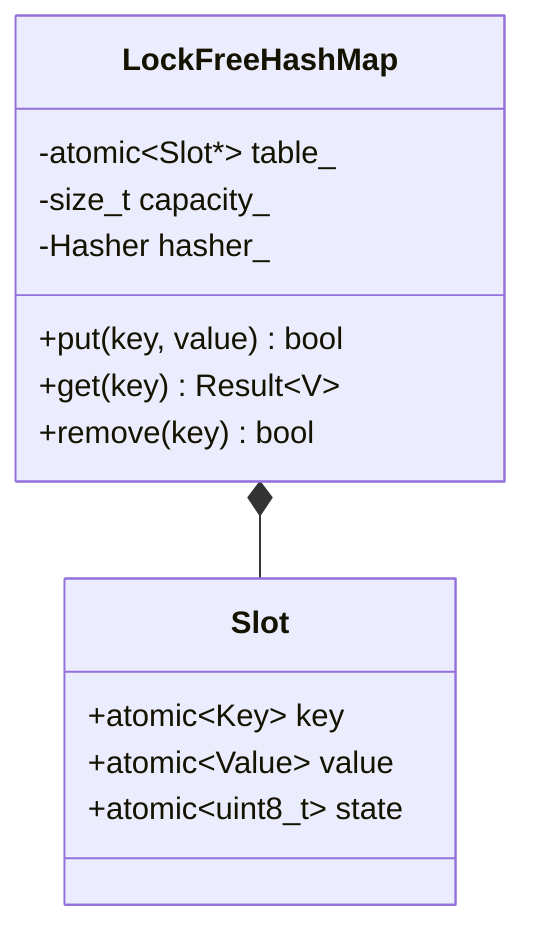
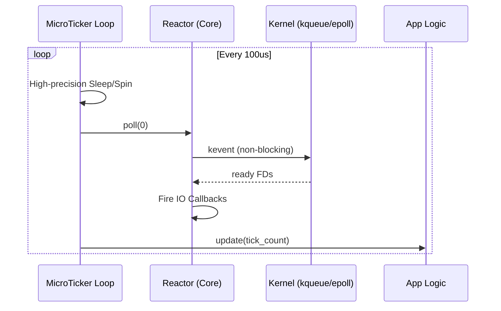
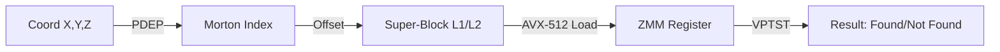

# High-Performance Essential Primitives Design

This document provides a detailed technical specification for the high-performance primitives introduced in v2.4.0. These modules are designed as **Level 7 Extensions**, providing specialized infrastructure for zero-latency and zero-allocation applications.

## 1. LockFreeHashMap<K, V>

A Multiple-Producer Multiple-Consumer (MPMC) non-blocking hash map using open addressing and atomic state transitions.

### Technical Specification
- **Algorithm**: Open addressing with linear probing (to maximize cache-line prefetching).
- **Storage**: A flat array of `Slot` structures.
- **Slot State**: `Empty` -> `Busy` (during insertion) -> `Committed` -> `Tombstone` (deleted).
- **Concurrency**: `std::atomic<uint64_t>` based key-value pairs (using 128-bit CAS if available, or splitting into hash/pointer).

### UML Component Diagram


> [!CAUTION]
> **ABA Problem**: Since this map uses open addressing without complex garbage collection, it is primarily designed for **pointer-stable** values or values that fit within an atomic word. For complex objects, use `GenerationPool` to obtain handles.

---

## 2. GenerationPool<T>

A lock-free object pool that solves the ABA problem by using versioned handles instead of raw pointers.

### Handle Schema (64-bit)
- **Index** (32-bit): Index into the flat-array of objects.
- **Generation** (32-bit): Incremented every time a slot is reused.

### Handle Safety & Resolution
```cpp
template <typename T>
T* GenerationPool<T>::resolve(Handle handle) noexcept {
    auto& slot = slots_[handle.index()];
    uint32_t current_gen = slot.generation.load(std::memory_order_acquire);
    
    // Check if the generation matches and the slot is not being released
    if (current_gen == handle.gen() && (current_gen & 1) == 0) {
        return reinterpret_cast<T*>(&slot.storage);
    }
    return nullptr;
}
```
> [!NOTE]
> We use the LSB of the generation as a "busy" flag during allocation/deallocation to prevent racing with `resolve()`.

---

## 3. IntrusiveList<T>

A zero-allocation linked list where the container's pointers are embedded within the stored objects.

### Implementation Pattern
- Objects must inherit from `IntrusiveNode`.
- **Benefits**:
    - No `new Node{T}` allocation.
    - Objects can be part of multiple lists (via multiple bridge nodes).
    - $O(1)$ removal if the object pointer is known.

---

## 4. MicroTicker (Reactor Integration)

`MicroTicker` is a precision heart-beat engine that replaces the passive OS-wait model with an active, high-resolution steering model. It is designed to drive `qbuem::Reactor` for applications requiring deterministic sub-millisecond execution (e.g., 10μs ~ 100μs intervals).

### The "Passive vs. Active" Problem
- **Passive Wait (`Reactor::poll(ms)`)**: The CPU yields to the kernel. Re-scheduling after an event or timeout depends on the kernel's HZ (often 1000/250) and current load, leading to **±500μs jitter**.
- **Active Drive (`MicroTicker`)**: One thread is dedicated to maintaining the beat. It uses a combination of `nanosleep` for long waits and **busy-spinning** for the final microseconds, achieving **<5μs jitter**.

### Ticker-Reactor Integration Pattern
The `MicroTicker` does not replace the `Reactor`; it **drives** it by calling `poll(0)` (non-blocking).

#### Implementation Example
```cpp
// 1. Initialize Reactor and MicroTicker (100us interval)
auto reactor = qbuem::create_reactor();
qbuem::MicroTicker ticker(100us);

// 2. Drive the loop
ticker.run([&](uint64_t tick_idx) {
    // Current time: exactly N * 100us (within ~2us error)

    // [Step A] Process IO and Timers without blocking
    // poll(0) checks kqueue/epoll and fires ready callbacks immediately.
    reactor->poll(0);

    // [Step B] Execute Fixed-Interval Logic
    // e.g., Update physics, Matching engine, or Sensor fusion.
    my_logic.update(tick_idx);

    // [Step C] Flush Channels
    // Push results to lock-free buffers or SHM.
    my_output.flush();
});
```

### UML Sequence: Precision Pull


### Jitter Compensation Algorithm
`MicroTicker` tracks the drift. If a tick finishes late (e.g., at 105μs), the next sleep duration is shortened to compensate, ensuring the **mean frequency** remains perfectly stable.

> [!TIP]
> **Core Isolation**: For maximum performance, pin the `MicroTicker` thread to a dedicated CPU core using `qbuem::pin_reactor_to_cpu()` and isolate it from the OS scheduler (`isolcpus`).

---

## 5. GridBitset<Dim> (2.5D/3D Support)

A spatial bitset flattened into a 1D array, optimized for SIMD bitwise queries.

### Coordinate Mapping
- **2D**: `index = y * W + x`
- **2.5D**: `index = (layer * H + y) * W + x`
- **3D**: `index = ((z * H) + y) * W + x`

### Nanosecond-Level Optimization (The "Precision Grid")
To achieve query times in the 10ns ~ 50ns range, `GridBitset` employs hardware-specific optimizations.

#### 1. Morton Code via BMI2 (PDEP/PEXT)
Instead of expensive loops or lookup tables for Z-order curves, we use the `PDEP` (Parallel Bits Deposit) instruction to interleave bits in $O(1)$ time.
- **2D**: `morton = _pdep_u64(x, 0x5555...) | _pdep_u64(y, 0xAAAA...)`
- **Result**: Spatially local coordinates are guaranteed to be in the same or adjacent cache lines.

#### 2. Cache-Line Blocking (512-bit Super-Blocks)
The bitset is organized into **Super-Blocks** of $8\times 8\times 8 = 512$ bits.
- **Alignment**: Each Super-Block is 64-byte aligned (matches x86/ARM cache line).
- **SIMD**: A single **AVX-512** register can load an entire 3D sub-volume (8x8x8).
- **Zero-Branching**: `find-in-box` queries are reduced to a series of `VPAND` (Vector Bitwise AND) and `VPTST` (Vector Test) instructions.

#### 3. Wait-Free Snapshot (Read Path)
Using `std::atomic<uint64_t>` for the underlying storage allows multiple threads to perform spatial queries without any locks or memory barriers beyond `memory_order_relaxed` (for data consistency, as bitsets are usually eventual-consistent in high-speed reactors).

### UML Architecture: Nanosecond Query Pipeline


> [!IMPORTANT]
> **SIMD Verticality**: In 2.5D, we store 64 vertical layers in a single `uint64_t`. This allows "is there anything between floor 2 and 5?" to be answered by `(bitmap[idx] & mask_2_to_5) != 0` in **~1ns**.

---

## ⚠️ Critical Cautionary Notes

### 1. Overflow & Boundary Safety
In extreme-performance systems, every bit counts, but overflow can lead to catastrophic failure.

- **Generation Overflow (`GenerationPool`)**: With 32-bit generations, a slot reused every 1ns will overflow in 4 seconds. 
    - **Mitigation**: We use **64-bit tickets** or **LSB Busy-Flagging** to ensure that a handle cannot be resolved while a slot is in the middle of a generation transition.
- **Coordinate Overflow (`GridBitset`)**: Morton codes for 3D $(1024^3)$ fit in 30 bits ($10 \times 3$ bits). However, input $X, Y, Z$ must be strictly clamped.
    - **Mitigation**: Use `_pext_u64` to validate that input coordinates are within the defined mask before interleaving.
- **Integer Wrap-around (`MicroTicker`)**: While a 64-bit nanosecond counter won't wrap in our lifetime, **Tick Drift** calculations (signed differences) can overflow if the CPU is suspended for a long period.
    - **Mitigation**: Use `std::chrono::steady_clock` and explicit checks for `drift > interval`.

### 2. Concurrency & Performance
- **Memory Ordering**: All lock-free structures must use `std::memory_order_acquire/release` at minimum. Avoid `std::memory_order_seq_cst` unless absolutely necessary to reduce cache-coherency traffic.
- **False Sharing**: Ensure that frequently modified atomics (like a pool's head and tail) are on separate cache lines using `alignas(kCacheLineSize)`.
- **Branch Prediction**: In `MicroTicker`, use `QBUEM_LIKELY` for the "not yet timed out" condition to keep the pipeline full.
- **SIMD Alignment**: Ensure `GridBitset` buffers are aligned to 64-byte boundaries for AVX-512 compatibility.
