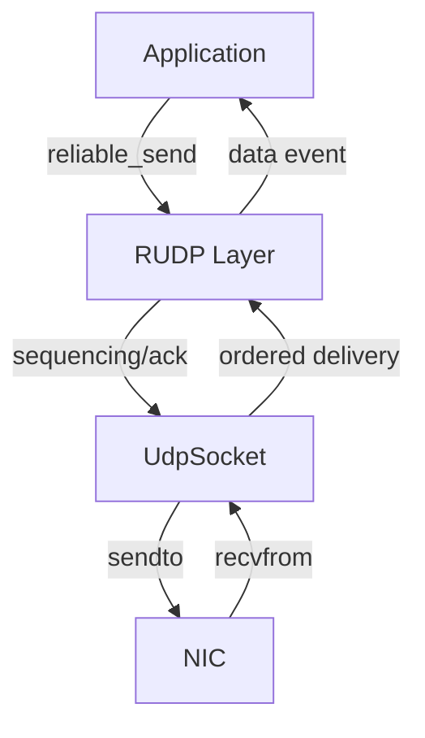

# qbuem-stack UDP Architecture & Advancement Proposal (v2.8.0+)

This document outlines the expansion of UDP support in `qbuem-stack` to address high-throughput and low-latency requirements for Gaming, Media, and HFT.

## 1. High-Throughput Batching (MMSG)
- **Concept**: Use `recvmmsg` and `sendmmsg` to process multiple datagrams in a single context switch.
- **API**: `co_await sock.recv_batch(std::span<MutableBufferView>, std::span<SocketAddr>)`.
- **Performance**: Reduces syscall overhead by up to 5x when handling small UDP packets (e.g., status syncs).

## 2. Reliable UDP (RUDP) Layer
- **Concept**: A lightweight reliability layer over UDP.
- **Features**:
  - **Sequencing**: Ordering packets to handle out-of-order delivery.
  - **Selective ACK/NACK**: Resending only lost packets.
  - **Sliding Window**: Flow control for high-speed transfers.
- **Use Case**: Real-time game state synchronization where TCP's head-of-line blocking is unacceptable.

## 3. Native Multicast Support
- **Requirement**: Efficient 1:N distribution for market data feeds.
- **API**: `sock.join_group(SocketAddr mcast_addr, std::string_view interface)`.
- **Implementation**: Low-level `setsockopt` wrapping for `IP_ADD_MEMBERSHIP` and `IPV6_JOIN_GROUP`.

## 4. Pipeline Integration (UdpSource/UdpSink)
- **Concept**: Treat UDP as a first-class citizen in the `StaticPipeline`.
- **Feature**: `PipelineBuilder::with_source(UdpSource(9000))` for instant high-speed ingress processing.

## 5. Unified Zero-Copy Path
- **Optimization**: Coordinate with `FixedPoolResource` to receive UDP packets directly into pre-allocated, cache-aligned buffers that can be passed through the pipeline.

---

## Technical UML: RUDP Stack

