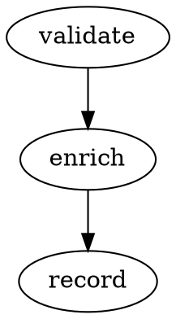

# pipeline_observer_health

**Category:** Pipeline
**File:** `pipeline_observer_health_example.cpp`
**Complexity:** Intermediate

## Overview

Demonstrates `PipelineObserver` and `PipelineHealth` — the built-in observability layer for pipelines. Each action stage emits `ActionMetrics`, and the health monitor aggregates throughput, latency percentiles, error rates, and pipeline version into exportable formats (JSON, DOT graph, Mermaid diagram).

## Scenario

A production service team needs to monitor a multi-stage pipeline without adding external APM dependencies. `PipelineObserver` hooks into each stage and provides real-time metrics; `PipelineHealth` rolls them up into health checks.

## Architecture Diagram

```
  Pipeline Execution
  ──────────────────────────────────────────────────────────
  Input
   │
   ▼
  Stage A  ──►  Stage B  ──►  Stage C
   │              │              │
   │  ActionMetrics (per stage)  │
   └──────────────┴──────────────┘
                  │
                  ▼
  ┌──────────────────────────────────────────────────────┐
  │  PipelineObserver                                    │
  │  ├─ throughput (items/sec)                           │
  │  ├─ latency p50 / p95 / p99                         │
  │  ├─ error_rate                                       │
  │  └─ PipelineVersion                                 │
  └──────────────────────────────────────────────────────┘
                  │
       ┌──────────┴──────────┐
       ▼                     ▼
  to_json()             to_dot()
  {"stage":"A",         digraph pipeline {
   "p99_us":42,           A -> B -> C
   "errors":0}          }
                        to_mermaid()
                        graph LR
                          A --> B --> C
```

## Key APIs Used

| API | Purpose |
|-----|---------|
| `PipelineObserver` | Hooks into pipeline stages to collect metrics |
| `ActionMetrics` | Per-stage counters: throughput, latency, errors |
| `PipelineHealth` | Aggregates metrics; provides health status |
| `PipelineVersion` | Semantic versioning for pipeline configurations |
| `observer.to_json()` | Export metrics as JSON |
| `observer.to_dot()` | Export pipeline topology as Graphviz DOT |
| `observer.to_mermaid()` | Export topology as Mermaid diagram |

## Output Formats

### JSON
```json
{
  "pipeline": "order-pipeline",
  "version": "1.2.0",
  "stages": [
    {"name": "validate", "throughput": 1200, "p99_us": 42, "errors": 0},
    {"name": "enrich",   "throughput": 1200, "p99_us": 18, "errors": 0}
  ],
  "health": "GREEN"
}
```

### DOT (Graphviz)


### Mermaid


## How to Run

```bash
cmake -B build -DCMAKE_BUILD_TYPE=Release
cmake --build build --target pipeline_observer_health_example
./build/examples/05-pipeline/observer_health/pipeline_observer_health_example
```

## Notes

- Health states: `GREEN` (all OK), `YELLOW` (degraded), `RED` (critical).
- `PipelineVersion` follows semver; bumping the minor version signals a hot-swap event.
- DOT output can be rendered with `dot -Tsvg pipeline.dot -o pipeline.svg`.
